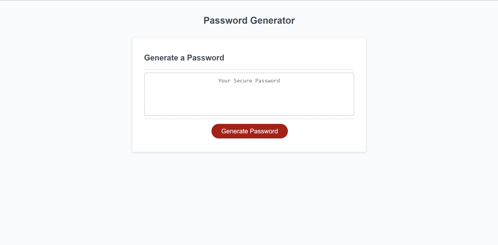

# Snarky Password Generator

## Description

This will generate a random password that will fit your needs.

## Installation

N/A

## Usage

Click on the generate password button and then follow the prompts.
## Credits

N/A

## License

Please refer to the LICENSE in the repo.
---

## Resources
These links will take you to my github and the application itself
https://github.com/ivyreed/snarky-password-generator/settings/pages
https://ivyreed.github.io/snarky-password-generator/

This is a screenshot of the running application

## Features

The password generated can be between 8 and 128 charachters and involve symbols, numbers, capital letters, and lowercase letters.